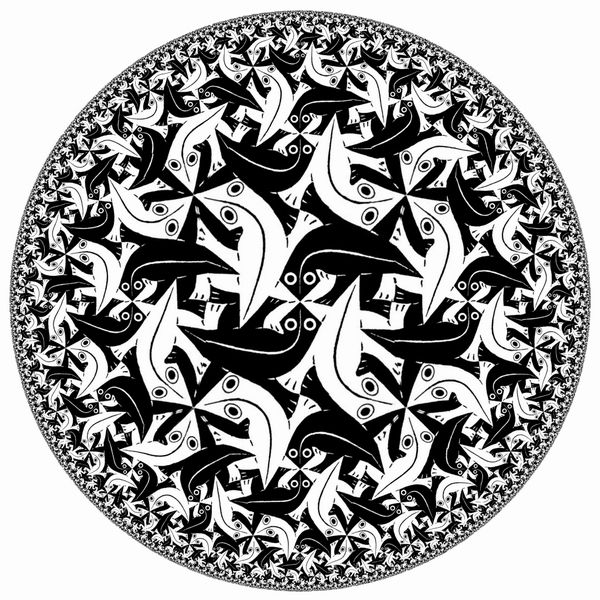
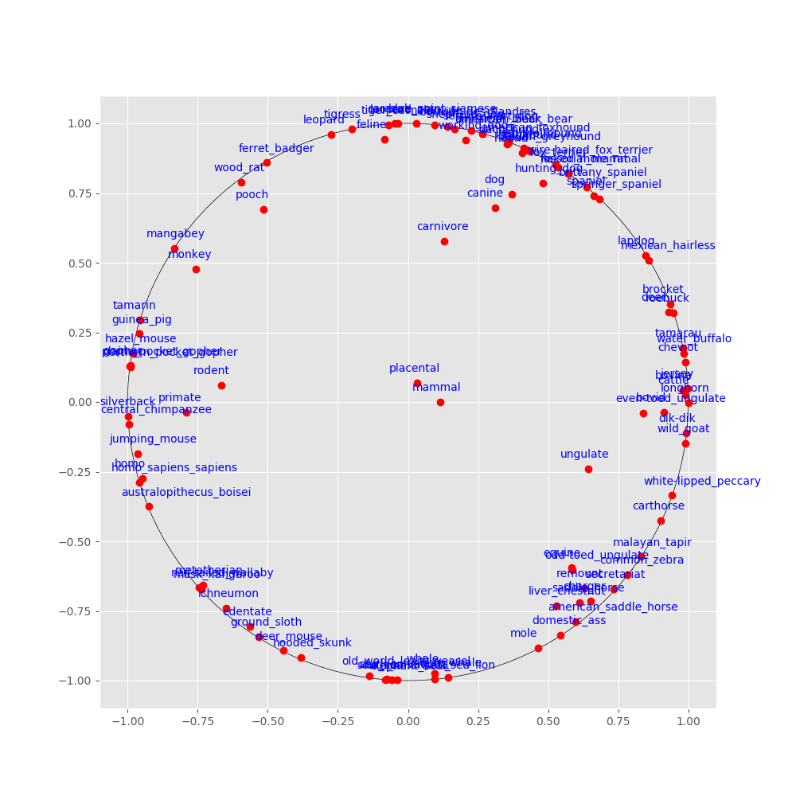

# Hyperbolic N-Space Embeddings for TensorFlow

<p align="center"></p>

Hyperbolic n-space, is a maximally symmetric, n-dimensional Riemannian manifold with constant negative sectional curvature. It turns out that hyperbolic space is very well suited for representing hierarchical data because it 'curves' space, allowing parent and sibling distances to stay constant over many branches without needing to increase dimensionality, as is the case in Euclidean space. A relatively intuitive model for thinking of embeddings in hyperbolic space is the poincare ball, where you can think of distances that increase exponentially as you move out from the center of the disk/ball.

This is an implementation of some basic functions for supporting hyperbolic geometries in the Poincare model (Lorentz to come) as well as functions to calculate riemann gradients over hyperbolic riemann manifolds.

<p align="center"></p>

#### Getting Started

The first thing you'll need to do is compile the cython modules.

```bash
python setup.py build_ext --inplace
```

Then, to run the demos, generate a transitive closure of hyper and hypo -nym relations from `wordnet`.   

```bash
cd wordnet
# this will generate the transitive closure over wordnet nouns, as well as a mammal subtree closure
python transitive_closure.py
```

Then, to train an embedding:
```bash

# either use the default parameters
sh train-mammals.sh

# or run embed.py with your own parameters
python3 embed.py \
       -dim 10 \
       -lr 0.5 \
       -epochs 100 \
       -negs 50 \
       -burnin 10 \
       -dset wordnet/mammal_closure.csv \
       -checkpoint checkpoints/my-checkpt.tf \
       -batchsize 30 \
       -eval_each 1

```

A similar script exists for the noun closure, but be warned it is very large.

#### Overview

The entry-point here is usually `embed.py` which is an executable that will initialize a new TF model and vector space embedding and train it.

There's only the Poincare manifold at the moment, but the Lorentz should come next. 

There's an optimizer that's not used in the demos, but runs the optimization over the particular manifold.

`plot.py` will do basic visualizations over a poincare disk or, experimentally using umap dimensionality squashing.

Training assumes the use of a sparse softmax cross entropy, which doesn't necessarily have to be the case, but is a good default measure here since we're trying to push apart negative sample sets during training. 

#### License
This code is licensed under [CC-BY-NC 4.0](https://creativecommons.org/licenses/by-nc/4.0/).


In part adapted from [poincare-embeddings](https://github.com/facebookresearch/poincare-embeddings)
